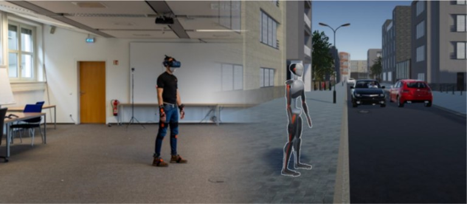

# A Pedestrian Dataset Captured in Virtual Environments

  

## Abstract

Software solutions for advanced driver assistant systems should be culturally fair, in particular when perceiving and reacting to pedestrians. To ensure the generation of suitable training and testing scenarios, a detailed understanding of pedestrian behavior and cultural differences in behavior must be established. However, direct comparisons between the populations in different countries are scarce and complicated to conduct in real environments.

In scope of the projects REACT and MOMENTUM, a new and large-scale virtual reality (VR) environment was created to capture pedestrian behavior, motion, and gaze in virtual crossing scenarios. The environment allows users to navigate freely in a space up to 10x10m. Besides helping to a better understanding of pedestrian behavior, the primary target is to enable a data source, which can be utilized to train generative and predictive algorithms for pedestrian simulation, perception, and interaction.

The original experiment was published by "Sprenger, J., Hell, L., Klusch, M., Kobayashi, Y., Kudo, S., & Müller, C. (2023, June). Cross-Cultural Behavior Analysis of Street-Crossing Pedestrians in Japan and Germany. In 2023 IEEE Intelligent Vehicles Symposium (IV) (pp. 1-7). IEEE." as a joint work between the ASR group at DFKI (Germany) and the HARC-EXPART team at AIST (Japan).

In this project, we are gathering the annonymized data from our experiments. As we are considering a broad range of aspects based on this data, we are still working on the processing, evaluation, and demonstration of multiple aspects. As such, this is still work in progress and not yet complete.

## Published Datasets

-   [Statistical Dataset](data/StatisticalData/) (V1 - German): In this dataset, we extracted several variables required for the statistical analysis and evaluation of the experiment.

## Funding Research Projects

This work has been partially funded by the German Ministry for Research and Education (BMBF) in the project REACT under grant 01IW17003, and partly by the New Energy and Industrial Technology Development (NEDO; JPNP18010).
